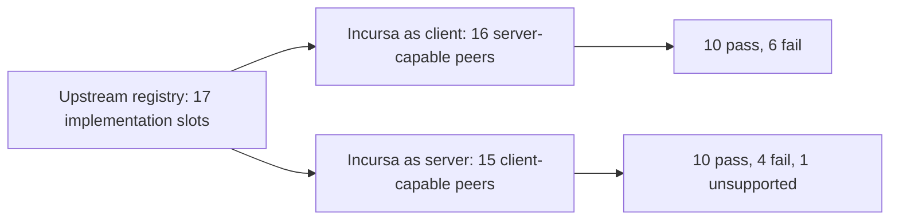

# QUIC Interop All-Implementation Handshake Local Report

This report summarizes the local all-upstream `handshake` run for `REQ-QUIC-INT-0027`.
It is derived evidence, not a broader support claim. The canonical requirement remains
`specs/requirements/quic/SPEC-QUIC-INT.json`.

## Scope

Run date: May 18, 2026.

Runner checkout: `C:\src\quic-interop\quic-interop-runner` at `1d6f655`.

Runner registry: `C:\src\quic-interop\quic-interop-runner\implementations_quic.json`.

The upstream registry contained 17 QUIC implementation slots:

`quic-go`, `ngtcp2`, `mvfst`, `quiche`, `kwik`, `picoquic`, `aioquic`, `neqo`,
`nginx`, `msquic`, `chrome`, `xquic`, `lsquic`, `haproxy`, `quinn`, `s2n-quic`,
and `go-x-net`.

Only the upstream `handshake` testcase was run. The upstream runner defines that
testcase as a QUIC v1 handshake plus one generated 1 KiB HTTP/0.9 file download,
with no Retry and exactly one observed handshake. A pass here does not mean every
Incursa.Quic requirement passed, and it does not exercise `transfer`, `retry`,
`multiconnect`, `versionnegotiation`, `chacha20`, `keyupdate`, `resumption`,
`zerortt`, `v2`, `rebind-port`, `rebind-addr`, `connectionmigration`, or `http3`.



## Commands

Incursa as client against all upstream server-capable implementations:

```powershell
pwsh -NoProfile -File scripts\interop\Invoke-QuicInteropRunner.ps1 `
  -RunnerRoot C:\src\quic-interop\quic-interop-runner `
  -LocalRole client `
  -ImplementationSlot chrome `
  -PeerImplementationSlots all `
  -TestCases handshake `
  -ArtifactsRoot .artifacts\interop-runner\all-implementation-handshake-local\client
```

Incursa as server against all upstream client-capable implementations:

```powershell
pwsh -NoProfile -File scripts\interop\Invoke-QuicInteropRunner.ps1 `
  -RunnerRoot C:\src\quic-interop\quic-interop-runner `
  -LocalRole server `
  -ImplementationSlot nginx `
  -PeerImplementationSlots all `
  -TestCases handshake `
  -ArtifactsRoot .artifacts\interop-runner\all-implementation-handshake-local\server
```

## Artifact Roots

Client-role run:
`.artifacts\interop-runner\all-implementation-handshake-local\client\20260518-215910877-client-chrome`

Server-role run:
`.artifacts\interop-runner\all-implementation-handshake-local\server\20260518-220831118-server-nginx`

Both roots contain `runner-report.json`, `runner-report.md`, `runner.stderr.log`,
`runner-logs`, and `artifact-tree.txt`.

## Result Matrix

`PASS` means the upstream runner marked `handshake` as `succeeded`.
`FAIL` means the runner marked `handshake` as `failed`.
`UNSUPPORTED` means the runner did not support that role/testcase combination.
`N/A` means the registry role did not make the peer eligible for that side of the matrix.

| Peer | Incursa client vs peer server | Incursa server vs peer client | First-pass classification |
| --- | --- | --- | --- |
| aioquic | PASS | FAIL | Server-side mixed compatibility gap; peer client timed out after more than 60 seconds. |
| chrome | N/A | UNSUPPORTED | Upstream runner unsupported for this server-role cell. |
| go-x-net | PASS | FAIL | Server-side mixed compatibility gap; peer client reported handshake timeout / CONNECTION_REFUSED. |
| haproxy | FAIL | N/A | Client-side Incursa compatibility gap candidate; Incursa reported TLS alert 50. |
| kwik | PASS | PASS | Passing handshake cell in both eligible roles. |
| lsquic | PASS | PASS | Passing handshake cell in both eligible roles. |
| msquic | FAIL | PASS | Client-side compatibility gap candidate; Incursa reported TLS alert 50 in client role, while Incursa server passed msquic client. |
| mvfst | FAIL | PASS | Client-side application response mismatch; handshake reached request path but no response body completed before timeout. |
| neqo | FAIL | PASS | Client-side Incursa compatibility gap candidate; Incursa reported TLS alert 50. |
| nginx | PASS | N/A | Passing Incursa-client handshake against server-only peer. |
| ngtcp2 | FAIL | PASS | Client-side Incursa compatibility gap candidate; Incursa reported TLS alert 50. |
| picoquic | PASS | FAIL | Server-side mixed compatibility gap; peer client idle-timeout/runner timeout. |
| quic-go | PASS | PASS | Passing handshake cell in both eligible roles. |
| quiche | PASS | FAIL | Server-side mixed compatibility gap; peer client exited 255. |
| quinn | PASS | PASS | Passing handshake cell in both eligible roles. |
| s2n-quic | PASS | PASS | Passing handshake cell in both eligible roles. |
| xquic | FAIL | PASS | Client-side compatibility gap candidate; Incursa client handshake timed out while peer logged packet processing errors. |

## Aggregate Result

Incursa client role:

| Outcome | Count | Peers |
| --- | ---: | --- |
| PASS | 10 | `aioquic`, `go-x-net`, `kwik`, `lsquic`, `nginx`, `picoquic`, `quic-go`, `quiche`, `quinn`, `s2n-quic` |
| FAIL | 6 | `haproxy`, `msquic`, `mvfst`, `neqo`, `ngtcp2`, `xquic` |

Incursa server role:

| Outcome | Count | Peers |
| --- | ---: | --- |
| PASS | 10 | `kwik`, `lsquic`, `msquic`, `mvfst`, `neqo`, `ngtcp2`, `quic-go`, `quinn`, `s2n-quic`, `xquic` |
| FAIL | 4 | `aioquic`, `go-x-net`, `picoquic`, `quiche` |
| UNSUPPORTED | 1 | `chrome` |

## What Was Fixed During This Run

The first real Incursa-client smoke run failed before the all-peer matrix because
the harness tried to read the runner-generated source file from `/www` in the
local client container. That file is mounted into the upstream server container,
not always into the local client container.

The harness now falls back to reading the HTTP/0.9 response until the peer closes
the stream when the source length is unavailable locally. The fix was verified
with a local Incursa-client `quic-go` smoke run and the focused `REQ-QUIC-INT-0027`
test filter.

## Ownership Assessment

The remaining failures are not all the same kind of problem.

| Failure cluster | Cells | Current read |
| --- | --- | --- |
| Client-side TLS alert 50 | `haproxy`, `msquic`, `neqo`, `ngtcp2` with Incursa as client | Treat as an Incursa-client compatibility gap candidate. A single peer could be peer-specific, but four independent peers with the same alert class is enough to keep this on our side of the triage board until a transcript-level proof says otherwise. |
| Client-side handshake timeout | `xquic` with Incursa as client | Treat as an Incursa-client compatibility gap candidate. The peer logged packet processing errors, but the cell is still our interoperability gap until packet/transcript evidence identifies a peer bug. |
| Client-side no response body | `mvfst` with Incursa as client | Mixed. The QUIC connection reached the request path, but the peer did not complete an HTTP/0.9 response before the harness timeout. This needs request/stream-level replay before assigning blame. |
| Server-side peer-client failures | `aioquic`, `go-x-net`, `picoquic`, `quiche` with Incursa as server | Mixed. Incursa server passed 10 other clients, so these are not broad server failure evidence, but each remains a compatibility gap until the peer-specific log and packet traces are reduced. |
| Unsupported runner cell | `chrome` with Incursa as server | Not an Incursa failure. The upstream runner marked it unsupported. |

## Next Runtime Target

The highest-value next fix target is the client-side TLS alert 50 cluster because
it affects four independent upstream server implementations in the same local
role. The next focused investigation should reduce one representative cell,
preferably `ngtcp2` or `neqo`, to a transcript-level cause before changing TLS
or transport-parameter behavior.

The server-side failures should stay in a separate peer-characterization lane
until one of them produces a concrete Incursa-side protocol defect.
