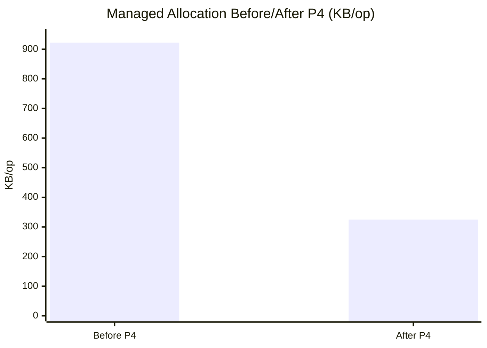
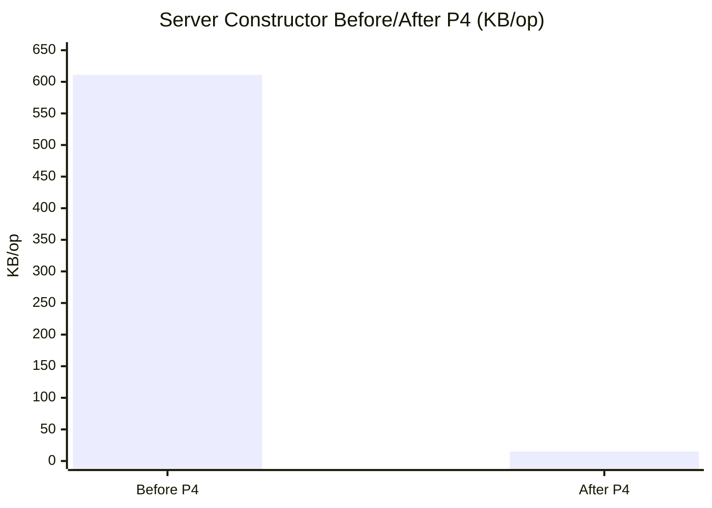
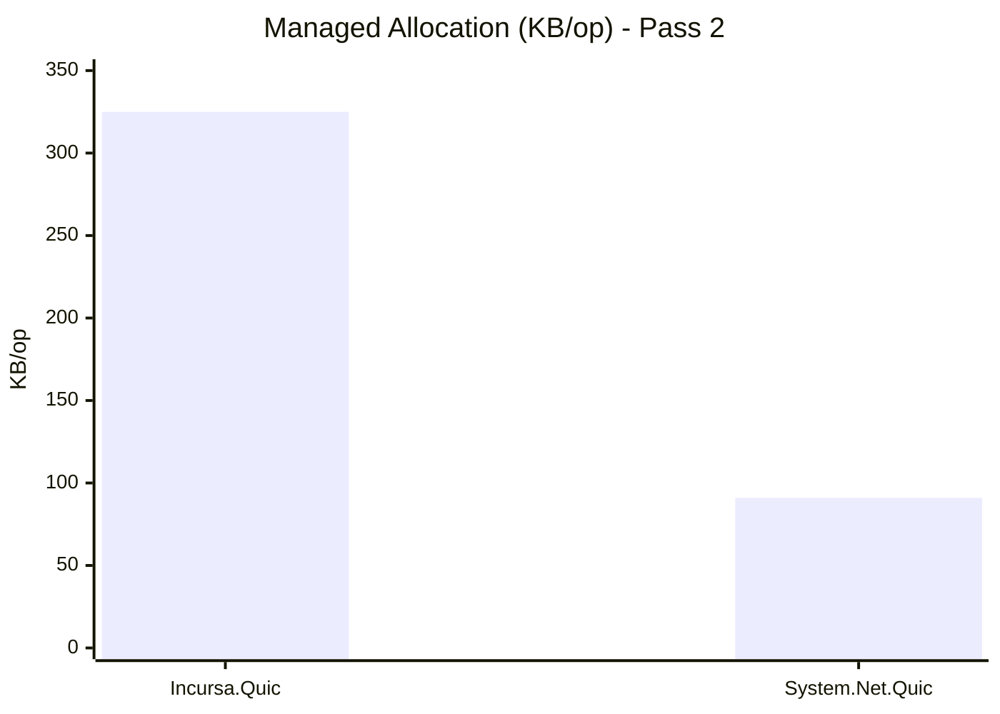
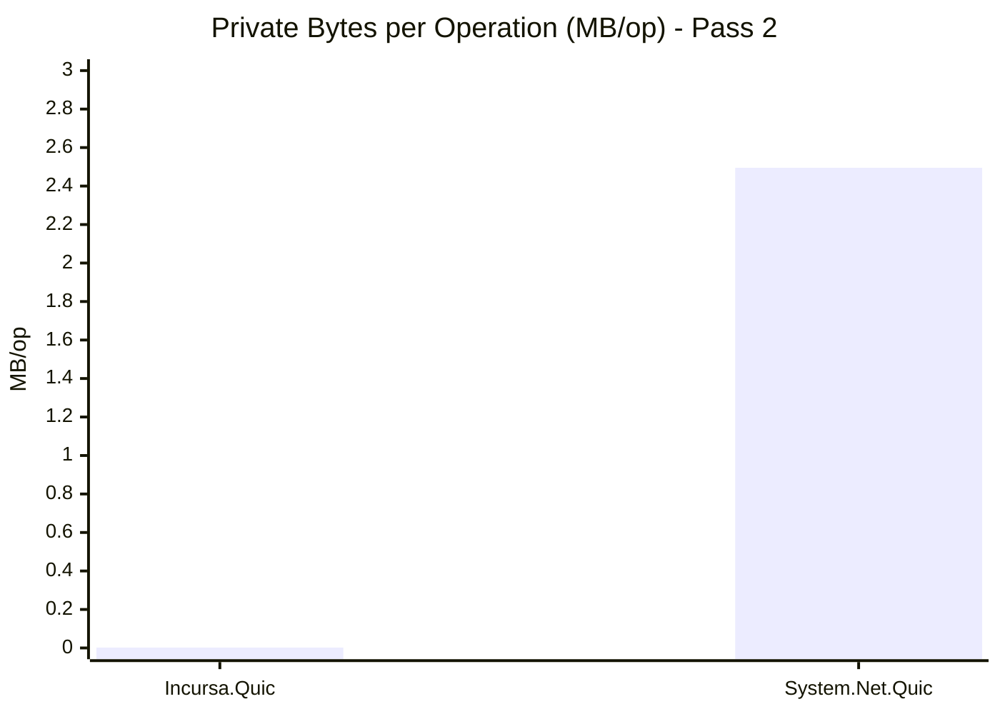
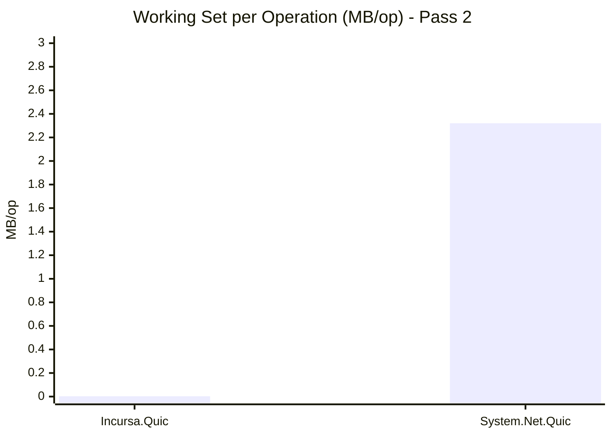
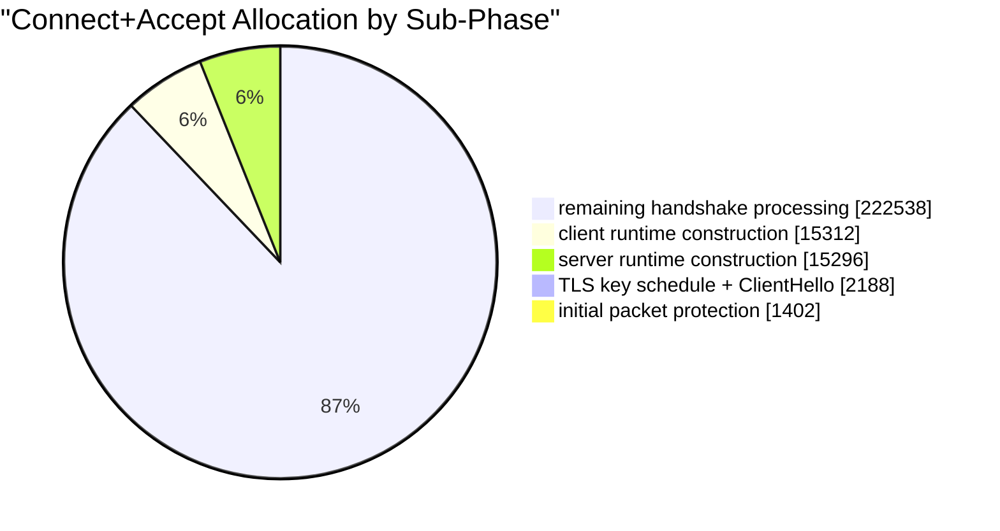
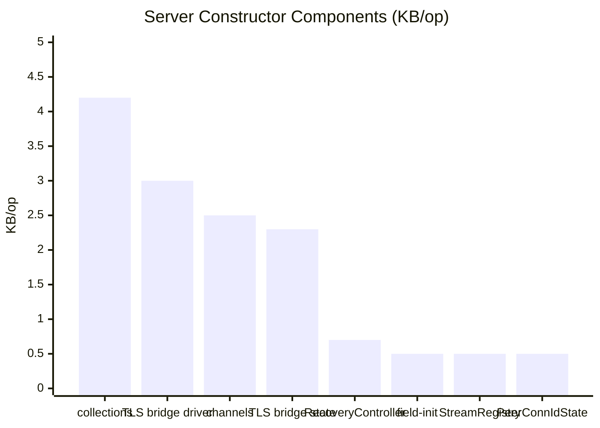

# Performance Charts

## 1. Before vs After P4: Total Managed Allocation



## 2. Before vs After P4: Server Constructor Allocation



## 3. Incursa.Quic vs System.Net.Quic: Managed Allocation



## 4. Incursa.Quic vs System.Net.Quic: Private Bytes / Working Set





## 5. Connect+Accept Sub-Phase Breakdown



## 6. Server Runtime Constructor Breakdown (Top 8)



## 7. Lifecycle Phase Breakdown

```mermaid
pie showData
  title "Allocation by Lifecycle Phase"
  "connect+accept" : 256780
  "listener" : 46928
  "close+dispose" : 33912
