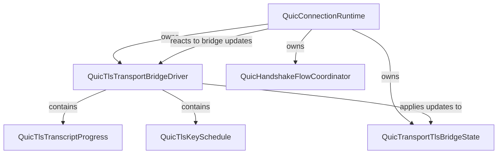
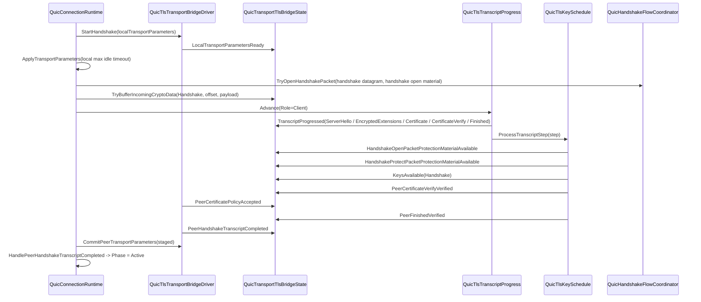
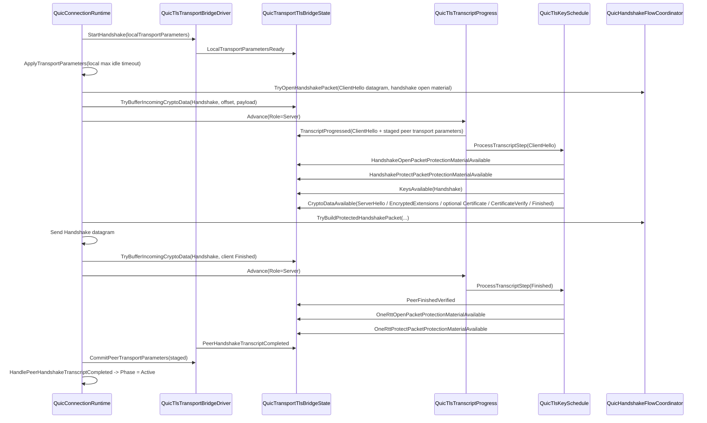

# QUIC/TLS Handshake Seam Walkthrough

This is a reviewer aid for the code as it exists today. It is not a requirement artifact and it does not rewrite the architecture. Read it as a map of the current seam, the current ownership boundaries, and the current proof/commit split.

The important distinction throughout is between transcript progression, cryptographic proof, local policy acceptance, peer transport-parameter commit, and runtime phase transitions.

## How To Read This

Read in this order:
1. Ownership map.
2. Component / ownership diagram.
3. Client and server sequence diagrams.
4. The file-by-file walkthroughs, top to bottom.
5. The glossary and risk sections last.

30-minute skim path:
1. Read the ownership map.
2. Skim the component diagram.
3. Read `QuicConnectionRuntime.cs`, `QuicTransportTlsBridgeState.cs`, `QuicTlsTransportBridgeDriver.cs`, and `QuicTlsKeySchedule.cs`.
4. Skim the client and server flow diagrams.
5. Read the review-risk section.

90-minute deep-review path:
1. Read `QuicTlsTransport.cs`.
2. Read `QuicTransportTlsBridgeState.cs`.
3. Read `QuicTlsTranscriptProgress.cs`.
4. Read `QuicTlsKeySchedule.cs`.
5. Read `QuicTlsTransportBridgeDriver.cs`.
6. Read `QuicHandshakeFlowCoordinator.cs`.
7. Read `QuicConnectionRuntime.cs`.
8. Re-read the client and server path walkthroughs against the glossary.
9. End with the review-risk section and remaining blockers.

## Ownership Map

| Type | What it owns | What it does not own | Why the boundary matters |
| --- | --- | --- | --- |
| `QuicConnectionRuntime` | The connection-owned reducer, `Phase`, `SendingMode`, runtime transport flags, path/timer orchestration, and the translation from bridge updates into runtime effects. | TLS parsing, transcript ordering, cryptographic proof, packet protection derivation, and certificate policy. | The runtime must react to bridge facts, not infer TLS internals. If it starts interpreting proof or policy itself, the seam stops being reviewable. |
| `QuicTlsTransportBridgeDriver` | The bridge orchestration layer, publication of `QuicTlsStateUpdate`, handshake bootstrap, inbound CRYPTO buffering, transcript driving, and the local policy check for a pinned peer leaf certificate. | Runtime phase transitions, path promotion, and packet-number-space management outside the bridge-visible handshake seam. | This is the translation layer. It should stay deterministic and keep bridge state updates separate from runtime decisions. |
| `QuicTransportTlsBridgeState` | The mutable bridge-visible facts and gates: transport parameters, transcript phase, proof flags, packet protection material, crypto buffers, and fatal alert state. | Message parsing, key derivation, packet assembly, and runtime lifecycle state. | This is where staged facts become committed facts. Reviewers should treat every predicate here as an explicit gate, not as a convenience property. |
| `QuicTlsTranscriptProgress` | Ordered Handshake CRYPTO progression, role-aware handshake parsing, transcript staging, ingress cursor tracking, and terminal parse failure. | Secret derivation, certificate verification, local policy, and runtime effects. | Transcript order decides what proof can happen later. If this file accepts the wrong bytes or the wrong order, everything downstream can look valid while being wrong. |
| `QuicTlsKeySchedule` | The narrow managed TLS 1.3 proof slice, handshake secret derivation, packet protection material derivation, certificate proof verification, Finished verification, and server-flight synthesis. | Packet framing, transport-parameter commit, and runtime phase transitions. | Proof and commit must remain separate. This type can prove something cryptographically, but it should not be mistaken for the code that decides whether the connection has entered active operation. |
| `QuicHandshakeFlowCoordinator` | Handshake packet open/build glue, long-header packet assembly, and CRYPTO payload layout. | Transcript parsing, proof, and policy. | This is packet-format code, not handshake semantics. It should remain narrow so packet handling can be reviewed separately from TLS proof logic. |

## Diagrams

### Component / Ownership



### Client-Path Handshake Flow



### Server-Path Handshake Flow



### State / Proof / Commit Relationship

```mermaid
flowchart LR
  TP["Transcript progression<br/>QuicTlsTranscriptProgress"]
  P1["Cryptographic proof<br/>QuicTlsKeySchedule"]
  PL["Local policy acceptance<br/>Pinned leaf SHA-256 check"]
  G["Bridge commit gate<br/>QuicTransportTlsBridgeState.CanCommitPeerTransportParameters()"]
  C["Peer transport-parameter commit<br/>PeerTransportParametersCommitted"]
  H["Bridge completion milestone<br/>PeerHandshakeTranscriptCompleted"]
  A["Runtime phase transition<br/>QuicConnectionRuntime.Phase = Active"]

  TP -->|TranscriptProgressed| G
  P1 -->|PeerCertificateVerifyVerified / PeerFinishedVerified / packet protection material| G
  PL -->|PeerCertificatePolicyAccepted| G
  G -->|TryCommitPeerTransportParameters()| C
  P1 -->|PeerHandshakeTranscriptCompleted gate uses proof state| H
  H -->|runtime handler| A
```

## File-By-File Walkthrough

### `src/Incursa.Quic/QuicTlsTransport.cs`

Why it matters: This file defines the exact vocabulary that the rest of the seam exchanges. `QuicTlsUpdateKind` and `QuicTlsStateUpdate` are the shared contract, and `IQuicTlsTransportBridge` is the surface the runtime expects.

Important members: `QuicTlsRole`, `QuicTlsEncryptionLevel`, `QuicTlsTranscriptPhase`, `QuicTlsUpdateKind`, `QuicTlsStateUpdate`, `IQuicTlsTransportBridge.StartHandshake`, `IQuicTlsTransportBridge.ProcessCryptoFrame`, `IQuicTlsTransportBridge.CommitPeerTransportParameters`.

Excerpt 1
Path: `src/Incursa.Quic/QuicTlsTransport.cs`
Lines: `73-122` (selected lines)
```csharp
internal enum QuicTlsTranscriptPhase
{
    AwaitingPeerHandshakeMessage = 0,
    PeerTransportParametersStaged = 1,
    Completed = 2,
    Failed = 3,
}

internal enum QuicTlsUpdateKind
{
    LocalTransportParametersReady = 0,
    PeerTransportParametersCommitted = 1,
    KeysAvailable = 2,
    PeerHandshakeTranscriptCompleted = 3,
    ...
    HandshakeOpenPacketProtectionMaterialAvailable = 12,
    HandshakeProtectPacketProtectionMaterialAvailable = 13,
    PeerCertificateVerifyVerified = 14,
    PeerCertificatePolicyAccepted = 15,
    OneRttOpenPacketProtectionMaterialAvailable = 16,
    OneRttProtectPacketProtectionMaterialAvailable = 17,
}

internal readonly record struct QuicTlsStateUpdate(
    QuicTlsUpdateKind Kind,
    QuicTlsEncryptionLevel? EncryptionLevel = null,
    QuicTransportParameters? TransportParameters = null,
    ...
    QuicTlsTranscriptPhase? TranscriptPhase = null);
```
What it does: It names the bridge states and updates that other code can publish and consume.

Why it matters: Every other seam file depends on these exact names. If a maintainer misreads one of these values, they will misread the rest of the flow.

Excerpt 2
Path: `src/Incursa.Quic/QuicTlsTransport.cs`
Lines: `124-158` (selected lines)
```csharp
internal interface IQuicTlsTransportBridge
{
    QuicTlsRole Role { get; }
    IReadOnlyList<QuicTlsStateUpdate> StartHandshake(QuicTransportParameters localTransportParameters);
    IReadOnlyList<QuicTlsStateUpdate> ProcessCryptoFrame(
        QuicTlsEncryptionLevel encryptionLevel,
        ReadOnlyMemory<byte> cryptoFramePayload);
    IReadOnlyList<QuicTlsStateUpdate> CommitPeerTransportParameters(
        QuicTransportParameters peerTransportParameters);
}
```
What it does: It declares the bridge contract the runtime can call.

Why it matters: This is the seam contract. The runtime should not depend on any deeper TLS implementation detail than these methods and the published updates they return.

### `src/Incursa.Quic/QuicTransportTlsBridgeState.cs`

Why it matters: This is the mutable bridge state and the gatekeeper for commit. It stores staged and committed transport parameters, transcript phase, proof flags, crypto buffers, and packet-protection material.

Important members: `CanCommitPeerTransportParameters`, `CanCommitServerPeerTransportParameters`, `CanEmitPeerHandshakeTranscriptCompleted`, `TryCommitLocalTransportParameters`, `TryCommitPeerTransportParameters`, `TryMarkPeerHandshakeTranscriptCompleted`, `TryMarkPeerCertificateVerifyVerified`, `TryMarkPeerCertificatePolicyAccepted`, `TryMarkPeerFinishedVerified`, `TryApplyTranscriptProgress`, `TrySetHandshakeTranscriptPhase`, `TryBufferIncomingCryptoData`, `TryBufferOutgoingCryptoData`, `TryGetHandshakeOpenPacketProtectionMaterial`, `TryGetHandshakeProtectPacketProtectionMaterial`.

Excerpt 1
Path: `src/Incursa.Quic/QuicTransportTlsBridgeState.cs`
Lines: `95-157` (selected lines)
```csharp
internal bool CanCommitPeerTransportParameters(QuicTransportParameters parameters)
{
    ...
    return !IsTerminal
        && !PeerTransportParametersCommitted
        && PeerCertificateVerifyVerified
        && PeerCertificatePolicyAccepted
        && PeerFinishedVerified
        && StagedPeerTransportParameters is not null
        && HandshakeTranscriptPhase == QuicTlsTranscriptPhase.Completed
        && HandshakeMessageType == QuicTlsHandshakeMessageType.Finished
        && HandshakeMessageLength.HasValue
        && SelectedCipherSuite.HasValue
        && TranscriptHashAlgorithm.HasValue
        && AreEquivalent(StagedPeerTransportParameters, parameters);
}

internal bool CanEmitPeerHandshakeTranscriptCompleted()
{
    ...
    return !IsTerminal
        && !PeerHandshakeTranscriptCompleted
        && PeerCertificateVerifyVerified
        && PeerFinishedVerified
        && StagedPeerTransportParameters is not null
        && HandshakeTranscriptPhase == QuicTlsTranscriptPhase.Completed
        && HandshakeMessageType == QuicTlsHandshakeMessageType.Finished
        && HandshakeMessageLength.HasValue
        && SelectedCipherSuite.HasValue
        && TranscriptHashAlgorithm.HasValue;
}
```
What it does: It encodes the commit gate and the handshake-completion gate as explicit predicates.

Why it matters: This is the difference between staged bridge facts and committed bridge facts. Reviewers should not treat `StagedPeerTransportParameters` or `PeerFinishedVerified` as enough by themselves.

Excerpt 2
Path: `src/Incursa.Quic/QuicTransportTlsBridgeState.cs`
Lines: `450-507` (selected lines)
```csharp
public bool TryCommitPeerTransportParameters(QuicTransportParameters parameters)
{
    ...
    QuicTransportParameters committedParameters = CloneTransportParameters(parameters);
    PeerTransportParameters = committedParameters;
    PeerTransportParametersCommitted = true;
    return true;
}

public bool TryMarkPeerHandshakeTranscriptCompleted()
{
    ...
    PeerHandshakeTranscriptCompleted = true;
    return true;
}

public bool TryMarkPeerCertificateVerifyVerified()
{
    ...
    PeerCertificateVerifyVerified = true;
    return true;
}

public bool TryMarkPeerCertificatePolicyAccepted()
{
    ...
    PeerCertificatePolicyAccepted = true;
    return true;
}

public bool TryMarkPeerFinishedVerified()
{
    ...
    PeerFinishedVerified = true;
    return true;
}
```
What it does: It turns bridge-visible updates into stored bridge state.

Why it matters: These methods are the narrow point where a published update becomes durable bridge state. They are not proof logic and they are not runtime phase transitions.

### `src/Incursa.Quic/QuicTlsTranscriptProgress.cs`

Why it matters: This file owns ordered Handshake CRYPTO progression. It is where message boundaries are parsed, peer transport parameters are staged, and malformed ordering turns into terminal failure.

Important members: `AppendCryptoBytes`, `Advance`, `TryParseClientHello`, `TryParseServerHello`, `TryParseEncryptedExtensions`, `TryParseCertificate`, `TryParseCertificateVerify`, `TryParseFinished`, `CommitParsedMessage`, `Fail`, `BuildFatalStep`.

Excerpt 1
Path: `src/Incursa.Quic/QuicTlsTranscriptProgress.cs`
Lines: `87-123`
```csharp
internal void AppendCryptoBytes(ulong offset, ReadOnlySpan<byte> cryptoBytes)
{
    if (terminalAlertDescription.HasValue || cryptoBytes.IsEmpty)
    {
        return;
    }

    if (phase is QuicTlsTranscriptPhase.Completed or QuicTlsTranscriptPhase.Failed)
    {
        Fail(HandshakeTranscriptUnavailableAlertDescription);
        return;
    }

    if (offset != ingressCursor)
    {
        Fail(HandshakeTranscriptParseFailureAlertDescription);
        return;
    }

    ...
}

internal QuicTlsTranscriptStep Advance(QuicTlsRole role)
{
    if (role != this.role)
    {
        Fail(HandshakeTranscriptParseFailureAlertDescription);
        return BuildFatalStep();
    }
    ...
}
```
What it does: It only accepts ordered CRYPTO bytes for the owning role and fails fast on wrong-order input.

Why it matters: The rest of the handshake proof only works if this file preserves the transcript boundary exactly.

Excerpt 2
Path: `src/Incursa.Quic/QuicTlsTranscriptProgress.cs`
Lines: `819-861`
```csharp
private void CommitParsedMessage(ParsedHandshakeMessage parsedMessage)
{
    handshakeMessageType = parsedMessage.HandshakeMessageType;
    handshakeMessageLength = parsedMessage.HandshakeMessageLength;

    if ((parsedMessage.HandshakeMessageType == QuicTlsHandshakeMessageType.ServerHello
        || parsedMessage.HandshakeMessageType == QuicTlsHandshakeMessageType.ClientHello)
        && parsedMessage.SelectedCipherSuite.HasValue)
    {
        selectedCipherSuite = parsedMessage.SelectedCipherSuite;
    }

    ...

    if (parsedMessage.TransportParameters is not null)
    {
        stagedPeerTransportParameters = parsedMessage.TransportParameters;
    }

    phase = parsedMessage.TranscriptPhase;
    progressState = parsedMessage.NextProgressState;
}

private TranscriptAdvanceResult Fail(ushort alertDescription)
{
    terminalAlertDescription = alertDescription;
    phase = QuicTlsTranscriptPhase.Failed;
    progressState = HandshakeProgressState.Failed;
    partialTranscript.Clear();
    return TranscriptAdvanceResult.Failed;
}
```
What it does: It commits the parsed transcript message, stages transport parameters when present, and latches terminal failure.

Why it matters: This is the point where transcript progression becomes bridge-visible state. Anything that reads `HandshakeMessageType`, `SelectedCipherSuite`, or `StagedPeerTransportParameters` is reading this commit.

### `src/Incursa.Quic/QuicTlsKeySchedule.cs`

Why it matters: This is the proof engine and secret-derivation slice. It derives handshake secrets, verifies client certificate proof, verifies Finished, and on server role emits the local handshake flight and later 1-RTT packet-protection material.

Important members: `ProcessTranscriptStep`, `ProcessClientHello`, `ProcessServerHello`, `ProcessCertificate`, `ProcessCertificateVerify`, `ProcessFinished`, `TryDeriveHandshakeTrafficSecrets`, `TryDeriveApplicationPacketProtectionMaterial`, `BuildFatalAlert`.

Excerpt 1
Path: `src/Incursa.Quic/QuicTlsKeySchedule.cs`
Lines: `195-236`
```csharp
internal IReadOnlyList<QuicTlsStateUpdate> ProcessTranscriptStep(QuicTlsTranscriptStep step)
{
    return ProcessTranscriptStep(step, localTransportParameters: null);
}

internal IReadOnlyList<QuicTlsStateUpdate> ProcessTranscriptStep(
    QuicTlsTranscriptStep step,
    QuicTransportParameters? localTransportParameters,
    ReadOnlyMemory<byte> localServerLeafCertificateDer = default,
    ReadOnlyMemory<byte> localServerLeafSigningPrivateKey = default)
{
    if (isTerminal || step.HandshakeMessageType is null || step.HandshakeMessageBytes.IsEmpty)
    {
        return Array.Empty<QuicTlsStateUpdate>();
    }

    if (role == QuicTlsRole.Server)
    {
        return step.HandshakeMessageType.Value switch
        {
            QuicTlsHandshakeMessageType.ClientHello => ProcessClientHello(
                step,
                localTransportParameters,
                localServerLeafCertificateDer,
                localServerLeafSigningPrivateKey),
            QuicTlsHandshakeMessageType.Finished => ProcessFinished(step),
            _ => BuildFatalAlert(HandshakeTranscriptParseFailureAlertDescription),
        };
    }

    return step.HandshakeMessageType.Value switch
    {
        QuicTlsHandshakeMessageType.ServerHello => ProcessServerHello(step),
        QuicTlsHandshakeMessageType.EncryptedExtensions => AppendTranscriptMessage(step.HandshakeMessageBytes.Span),
        QuicTlsHandshakeMessageType.Certificate => ProcessCertificate(step),
        QuicTlsHandshakeMessageType.CertificateVerify => ProcessCertificateVerify(step),
        QuicTlsHandshakeMessageType.Finished => ProcessFinished(step),
        _ => AppendTranscriptMessage(step.HandshakeMessageBytes.Span),
    };
}
```
What it does: It routes each transcript step into the supported role-specific proof path.

Why it matters: This is where the seam separates client proof, server proof, and unsupported input. It is also where the code makes the supported subset explicit.

Excerpt 2
Path: `src/Incursa.Quic/QuicTlsKeySchedule.cs`
Lines: `239-380` (selected lines)
```csharp
if (handshakeSecretsDerived
    || step.Kind != QuicTlsTranscriptStepKind.PeerTransportParametersStaged
    || step.TranscriptPhase != QuicTlsTranscriptPhase.PeerTransportParametersStaged
    || step.HandshakeMessageType != QuicTlsHandshakeMessageType.ClientHello
    || step.HandshakeMessageLength is null
    || step.TransportParameters is null
    || step.SelectedCipherSuite != profile.CipherSuite
    || step.TranscriptHashAlgorithm != profile.TranscriptHashAlgorithm
    || step.NamedGroup != profile.NamedGroup
    || step.KeyShare.IsEmpty
    || localTransportParameters is null)
{
    return BuildFatalAlert(HandshakeTranscriptParseFailureAlertDescription);
}

AppendTranscriptMessage(step.HandshakeMessageBytes.Span);
if (!TryCreateServerHello(step.HandshakeMessageBytes.Span, out byte[] serverHelloBytes))
{
    return BuildFatalAlert(HandshakeTranscriptParseFailureAlertDescription);
}

AppendTranscriptMessage(serverHelloBytes);
ReadOnlySpan<byte> transcriptHash = HashTranscript();
if (!TryDeriveHandshakeTrafficSecrets(
        step.KeyShare.Span,
        transcriptHash,
        protectWithClientTrafficSecret: false,
        out QuicTlsPacketProtectionMaterial openMaterial,
        out QuicTlsPacketProtectionMaterial protectMaterial))
{
    return BuildFatalAlert(HandshakeTranscriptParseFailureAlertDescription);
}

if (!TryCreateEncryptedExtensions(localTransportParameters, out byte[] encryptedExtensionsBytes))
{
    return BuildFatalAlert(HandshakeTranscriptParseFailureAlertDescription);
}

List<QuicTlsStateUpdate> updates =
[
    new QuicTlsStateUpdate(
        QuicTlsUpdateKind.CryptoDataAvailable,
        QuicTlsEncryptionLevel.Handshake,
        CryptoDataOffset: 0,
        CryptoData: serverHelloBytes),
    new QuicTlsStateUpdate(
        QuicTlsUpdateKind.HandshakeOpenPacketProtectionMaterialAvailable,
        PacketProtectionMaterial: openMaterial),
    new QuicTlsStateUpdate(
        QuicTlsUpdateKind.HandshakeProtectPacketProtectionMaterialAvailable,
        PacketProtectionMaterial: protectMaterial),
    new QuicTlsStateUpdate(
        QuicTlsUpdateKind.KeysAvailable,
        QuicTlsEncryptionLevel.Handshake),
    new QuicTlsStateUpdate(
        QuicTlsUpdateKind.CryptoDataAvailable,
        QuicTlsEncryptionLevel.Handshake,
        CryptoDataOffset: encryptedExtensionsOffset,
        CryptoData: encryptedExtensionsBytes),
];

...
if (localServerLeafSigningKey is not null && certificateBytes is not null)
{
    ...
    updates.Add(new QuicTlsStateUpdate(
        QuicTlsUpdateKind.CryptoDataAvailable,
        QuicTlsEncryptionLevel.Handshake,
        CryptoDataOffset: finishedOffset,
        CryptoData: finishedBytes));

    localServerFlightCompleted = true;
}

handshakeSecretsDerived = true;
return updates;
```
What it does: It validates the supported server-role subset, derives handshake traffic secrets, produces the server handshake flight, and publishes the handshake key material updates.

Why it matters: This is the current server-path proof and local-flight seam. It is not a general TLS implementation, and it is not a runtime phase transition.

### `src/Incursa.Quic/QuicTlsTransportBridgeDriver.cs`

Why it matters: This is the deterministic bridge driver. It is the file that publishes bridge-visible updates, advances transcript progress, injects local policy acceptance, and relays the supported key schedule slice into the bridge state.

Important members: `Role`, `State`, `StartHandshake`, `ProcessCryptoFrame`, `CommitPeerTransportParameters`, `AdvanceHandshakeTranscript`, `TryApply`, `PublishLocalTransportParameters`, `PublishKeysAvailable`, `PublishKeyDiscard`, `PublishFatalAlert`, `PublishProhibitedKeyUpdateViolation`, `PublishTranscriptProgressed`, `PublishPeerCertificatePolicyAcceptance`, `PublishPeerHandshakeTranscriptCompleted`, `PublishKeyScheduleUpdates`.

Excerpt 1
Path: `src/Incursa.Quic/QuicTlsTransportBridgeDriver.cs`
Lines: `69-140`
```csharp
public IReadOnlyList<QuicTlsStateUpdate> StartHandshake(QuicTransportParameters localTransportParameters)
{
    List<QuicTlsStateUpdate> updates = [];

    AppendPublishedUpdates(updates, PublishLocalTransportParameters(localTransportParameters));

    return updates;
}

public IReadOnlyList<QuicTlsStateUpdate> ProcessCryptoFrame(
    QuicTlsEncryptionLevel encryptionLevel,
    ReadOnlyMemory<byte> cryptoFramePayload)
{
    ulong offset = GetNextIngressOffset(encryptionLevel);
    if (TryBufferIncomingCryptoData(encryptionLevel, offset, cryptoFramePayload, out _))
    {
        nextIngressOffsets[encryptionLevel] = SaturatingAdd(offset, (ulong)cryptoFramePayload.Length);
    }

    return AdvanceHandshakeTranscript(encryptionLevel);
}

public IReadOnlyList<QuicTlsStateUpdate> CommitPeerTransportParameters(
    QuicTransportParameters peerTransportParameters)
{
    return bridgeState.CanCommitPeerTransportParameters(peerTransportParameters)
        ? PublishCommittedPeerTransportParameters(peerTransportParameters)
        : Array.Empty<QuicTlsStateUpdate>();
}

public IReadOnlyList<QuicTlsStateUpdate> AdvanceHandshakeTranscript(QuicTlsEncryptionLevel encryptionLevel)
{
    if (encryptionLevel != QuicTlsEncryptionLevel.Handshake)
    {
        return Array.Empty<QuicTlsStateUpdate>();
    }

    if (bridgeState.IsTerminal)
    {
        return Array.Empty<QuicTlsStateUpdate>();
    }

    ...
    DrainBufferedHandshakeCryptoIntoTranscript();
    DriveTranscriptProgress(updates);
    return updates;
}
```
What it does: It exposes the bridge API and the current runtime path for handshake transcript advancement.

Why it matters: The runtime currently uses the lower-level buffer plus advance path, not the `ProcessCryptoFrame` convenience method. That distinction matters when reviewing the live seam.

Excerpt 2
Path: `src/Incursa.Quic/QuicTlsTransportBridgeDriver.cs`
Lines: `399-470` (selected lines)
```csharp
private IReadOnlyList<QuicTlsStateUpdate> PublishPeerCertificatePolicyAcceptance()
{
    if (pinnedPeerLeafCertificateSha256 is null
        || pinnedPeerLeafCertificateSha256.Length == 0
        || keySchedule is null
        || !bridgeState.CanEmitPeerCertificatePolicyAccepted())
    {
        return Array.Empty<QuicTlsStateUpdate>();
    }

    if (!keySchedule.TryGetPeerLeafCertificateSha256Fingerprint(out byte[] peerLeafCertificateSha256))
    {
        return Array.Empty<QuicTlsStateUpdate>();
    }

    try
    {
        if (!CryptographicOperations.FixedTimeEquals(pinnedPeerLeafCertificateSha256, peerLeafCertificateSha256))
        {
            return PublishFatalAlert(PeerCertificatePolicyMismatchAlertDescription);
        }

        return PublishUpdate(new QuicTlsStateUpdate(QuicTlsUpdateKind.PeerCertificatePolicyAccepted));
    }
    finally
    {
        CryptographicOperations.ZeroMemory(peerLeafCertificateSha256);
    }
}

private void DriveTranscriptProgress(List<QuicTlsStateUpdate> updates)
{
    while (true)
    {
        QuicTlsTranscriptStep step = handshakeTranscriptProgress.Advance(Role);

        switch (step.Kind)
        {
            case QuicTlsTranscriptStepKind.None:
                return;

            case QuicTlsTranscriptStepKind.Progressed:
            case QuicTlsTranscriptStepKind.PeerTransportParametersStaged:
            {
                IReadOnlyList<QuicTlsStateUpdate> progressedUpdates = PublishTranscriptProgressed(...);
                AppendPublishedUpdates(updates, progressedUpdates);
                if (progressedUpdates.Count == 0)
                {
                    return;
                }

                AppendPublishedUpdates(updates, PublishKeyScheduleUpdates(step));
                if (bridgeState.IsTerminal)
                {
                    return;
                }

                if (bridgeState.CanEmitPeerHandshakeTranscriptCompleted())
                {
                    AppendPublishedUpdates(updates, PublishPeerHandshakeTranscriptCompleted());
                }

                break;
            }

            case QuicTlsTranscriptStepKind.Fatal:
                if (step.AlertDescription.HasValue)
                {
                    AppendPublishedUpdates(updates, PublishFatalAlert(step.AlertDescription.Value));
                }
                return;
        }
    }
}
```
What it does: It injects the local certificate fingerprint policy and then turns transcript steps into bridge-visible progress, key updates, and handshake-completion milestones.

Why it matters: This is where proof, policy, and bridge completion are wired together. It is the most important "do not confuse these states" file in the current seam.

### `src/Incursa.Quic/QuicHandshakeFlowCoordinator.cs`

Why it matters: This file is the packet-format seam. It opens protected Handshake packets, builds protected Handshake packets, and computes the CRYPTO payload layout around them.

Important members: `TryOpenHandshakePacket`, `TryBuildProtectedHandshakePacket`, `TryBuildHandshakePlaintextPacket`, `TryFormatCryptoFramePayload`, `TryParseHandshakePayloadLayout`, `BuildLongHeaderPacket`.

Excerpt 1
Path: `src/Incursa.Quic/QuicHandshakeFlowCoordinator.cs`
Lines: `35-86`
```csharp
public bool TryOpenHandshakePacket(
    ReadOnlySpan<byte> protectedPacket,
    QuicTlsPacketProtectionMaterial material,
    out byte[] openedPacket,
    out int payloadOffset,
    out int payloadLength)
{
    openedPacket = [];
    payloadOffset = default;
    payloadLength = default;

    if (!QuicHandshakePacketProtection.TryCreate(material, out QuicHandshakePacketProtection protection))
    {
        return false;
    }

    byte[] openedPacketBuffer = new byte[protectedPacket.Length];
    if (!protection.TryOpen(protectedPacket, openedPacketBuffer, out int openedBytesWritten))
    {
        return false;
    }

    openedPacket = openedPacketBuffer.AsSpan(0, openedBytesWritten).ToArray();
    if (!TryParseHandshakePayloadLayout(
        openedPacket,
        out payloadOffset,
        out payloadLength))
    {
        return false;
    }

    return true;
}

public bool TryBuildProtectedHandshakePacket(
    ReadOnlySpan<byte> cryptoPayload,
    ulong cryptoPayloadOffset,
    QuicTlsPacketProtectionMaterial material,
    out byte[] protectedPacket)
{
    ...
}
```
What it does: It opens a protected Handshake packet and turns a CRYPTO payload into a protected Handshake packet.

Why it matters: This code is packet-format glue only. It should not be confused with transcript parsing or proof.

Excerpt 2
Path: `src/Incursa.Quic/QuicHandshakeFlowCoordinator.cs`
Lines: `109-150`
```csharp
private bool TryBuildHandshakePlaintextPacket(
    ReadOnlySpan<byte> cryptoPayload,
    ulong cryptoPayloadOffset,
    out byte[] plaintextPacket)
{
    plaintextPacket = [];

    if (!TryFormatCryptoFramePayload(
        cryptoPayload,
        cryptoPayloadOffset,
        out byte[] cryptoFramePayload,
        out int cryptoFramePayloadLength))
    {
        return false;
    }

    int paddedPayloadLength = Math.Max(cryptoFramePayloadLength, HandshakeMinimumProtectedPayloadLength);
    int packetNumberLength = HandshakePacketNumberLength;

    Span<byte> lengthFieldBuffer = stackalloc byte[QuicVariableLengthInteger.MaxEncodedLength];
    ulong lengthFieldValue = (ulong)(packetNumberLength + paddedPayloadLength + QuicInitialPacketProtection.AuthenticationTagLength);
    if (!QuicVariableLengthInteger.TryFormat(lengthFieldValue, lengthFieldBuffer, out int lengthFieldBytesWritten))
    {
        return false;
    }

    ...
}
```
What it does: It formats the Handshake long header, packet number, CRYPTO frame payload, and padding before protection is applied.

Why it matters: It is the only place in this slice that knows the Handshake packet layout details. Nothing here should be read as handshake proof or policy.

### `src/Incursa.Quic/QuicConnectionRuntime.cs`

Why it matters: This is the connection-owned reducer. It owns the runtime phase transitions, the handshake bootstrap path, the packet ingress path, the egress flush path, and the conversion of bridge updates into connection effects.

Important members: `Phase`, `SendingMode`, `PeerHandshakeTranscriptCompleted`, `HandleHandshakeBootstrapRequested`, `HandleTlsStateUpdated`, `TryHandleHandshakePacketReceived`, `TryProcessHandshakePacketPayload`, `TryFlushHandshakePackets`, `TryCommitLocalTransportParametersFromTlsBridgeState`, `TryCommitPeerTransportParametersFromTlsBridgeDriver`, `TryCommitPeerTransportParametersFromTlsBridgeState`, `HandlePeerHandshakeTranscriptCompleted`.

Excerpt 1
Path: `src/Incursa.Quic/QuicConnectionRuntime.cs`
Lines: `390-456`
```csharp
private bool HandleHandshakeBootstrapRequested(
    QuicConnectionHandshakeBootstrapRequestedEvent handshakeBootstrapRequestedEvent,
    long nowTicks,
    ref List<QuicConnectionEffect>? effects)
{
    if (phase != QuicConnectionPhase.Establishing
        || tlsState.IsTerminal
        || tlsState.LocalTransportParameters is not null)
    {
        return false;
    }

    QuicTransportParameters? localTransportParameters = handshakeBootstrapRequestedEvent.LocalTransportParameters;
    if (localTransportParameters is null)
    {
        return false;
    }

    IReadOnlyList<QuicTlsStateUpdate> updates = tlsBridgeDriver.StartHandshake(localTransportParameters);
    ...
}

private bool HandleTlsStateUpdated(
    QuicConnectionTlsStateUpdatedEvent tlsStateUpdatedEvent,
    long nowTicks,
    ref List<QuicConnectionEffect>? effects)
{
    bool stateChanged = tlsBridgeDriver.TryApply(tlsStateUpdatedEvent.Update);

    switch (tlsStateUpdatedEvent.Update.Kind)
    {
        case QuicTlsUpdateKind.LocalTransportParametersReady:
            stateChanged |= TryCommitLocalTransportParametersFromTlsBridgeState(nowTicks, ref effects);
            break;

        case QuicTlsUpdateKind.PeerCertificatePolicyAccepted:
        case QuicTlsUpdateKind.PeerFinishedVerified:
            stateChanged |= TryCommitPeerTransportParametersFromTlsBridgeDriver(nowTicks, ref effects);
            break;

        case QuicTlsUpdateKind.PeerHandshakeTranscriptCompleted:
            stateChanged |= TryCommitPeerTransportParametersFromTlsBridgeDriver(nowTicks, ref effects);
            if (tlsState.PeerHandshakeTranscriptCompleted)
            {
                stateChanged |= HandlePeerHandshakeTranscriptCompleted(...);
            }
            break;
        ...
    }
}
```
What it does: It starts the handshake, applies bridge updates, and decides when bridge completion should become runtime phase change.

Why it matters: This is the line between bridge-visible handshake facts and runtime-visible connection state. The runtime should not be asked to interpret TLS internals directly.

Excerpt 2
Path: `src/Incursa.Quic/QuicConnectionRuntime.cs`
Lines: `506-689` (selected lines)
```csharp
private bool TryHandleHandshakePacketReceived(
    QuicConnectionPacketReceivedEvent packetReceivedEvent,
    long nowTicks,
    ref List<QuicConnectionEffect>? effects)
{
    ReadOnlySpan<byte> datagram = packetReceivedEvent.Datagram.Span;
    if (!QuicPacketParser.TryGetPacketNumberSpace(datagram, out QuicPacketNumberSpace packetNumberSpace)
        || packetNumberSpace != QuicPacketNumberSpace.Handshake
        || !tlsState.TryGetHandshakeOpenPacketProtectionMaterial(out QuicTlsPacketProtectionMaterial packetProtectionMaterial)
        || !handshakeFlowCoordinator.TryOpenHandshakePacket(
            datagram,
            packetProtectionMaterial,
            out byte[] openedPacket,
            out int payloadOffset,
            out int payloadLength))
    {
        return false;
    }

    return TryProcessHandshakePacketPayload(
        openedPacket.AsSpan(payloadOffset, payloadLength),
        nowTicks,
        ref effects);
}

private bool TryProcessHandshakePacketPayload(
    ReadOnlySpan<byte> payload,
    long nowTicks,
    ref List<QuicConnectionEffect>? effects)
{
    ...
    if (!tlsBridgeDriver.TryBufferIncomingCryptoData(
        QuicTlsEncryptionLevel.Handshake,
        cryptoFrame.Offset,
        cryptoFrame.CryptoData.ToArray(),
        out _))
    {
        return false;
    }

    IReadOnlyList<QuicTlsStateUpdate> transcriptUpdates = tlsBridgeDriver.AdvanceHandshakeTranscript(
        QuicTlsEncryptionLevel.Handshake);
    if (transcriptUpdates.Count == 0)
    {
        payloadOffset += bytesConsumed;
        continue;
    }

    bool sawFatalAlert = false;
    foreach (QuicTlsStateUpdate transcriptUpdate in transcriptUpdates)
    {
        if (transcriptUpdate.Kind == QuicTlsUpdateKind.FatalAlert)
        {
            stateChanged |= HandleTlsStateUpdated(...);
            sawFatalAlert = true;
            break;
        }
    }

    if (!sawFatalAlert)
    {
        foreach (QuicTlsStateUpdate transcriptUpdate in transcriptUpdates)
        {
            if (transcriptUpdate.Kind is QuicTlsUpdateKind.PeerFinishedVerified
                or QuicTlsUpdateKind.PeerHandshakeTranscriptCompleted)
            {
                stateChanged |= HandleTlsStateUpdated(...);
            }
        }
    }
    ...
}

private bool TryFlushHandshakePackets(ref List<QuicConnectionEffect>? effects)
{
    ...
    if (phase != QuicConnectionPhase.Establishing
        || activePath is null
        || tlsState.HandshakeEgressCryptoBuffer.BufferedBytes <= 0
        || !tlsState.TryGetHandshakeProtectPacketProtectionMaterial(out QuicTlsPacketProtectionMaterial packetProtectionMaterial))
    {
        return false;
    }
    ...
    if (!handshakeFlowCoordinator.TryBuildProtectedHandshakePacket(
        cryptoChunk[..cryptoBytesWritten],
        cryptoOffset,
        packetProtectionMaterial,
        out byte[] protectedPacket))
    {
        break;
    }
    ...
    AppendEffect(ref effects, new QuicConnectionSendDatagramEffect(
        currentPath.Identity,
        protectedPacket));
}
```
What it does: It opens Handshake packets, feeds CRYPTO payload into transcript progression, reacts only to the bridge updates that affect runtime state, and flushes protected handshake packets when the bridge has egress data and protection material.

Why it matters: This is the live runtime path. Note that it does not own the transcript or proof logic itself; it reacts to the bridge's output.

## Client Path Walkthrough

1. `QuicConnectionRuntime.HandleHandshakeBootstrapRequested` owns the bootstrap step. It publishes `LocalTransportParametersReady` through `QuicTlsTransportBridgeDriver.StartHandshake`, which means the bridge now has a cloned copy of the local transport parameters. It does not mean peer parameters are committed or that any proof exists yet.

2. `QuicConnectionRuntime.TryHandleHandshakePacketReceived` owns the ingress side of the handshake path. It opens the Handshake packet with `QuicHandshakeFlowCoordinator.TryOpenHandshakePacket`, then buffers the CRYPTO payload into `QuicTransportTlsBridgeState` and advances transcript progress. That means the bytes are in order and parseable. It does not mean the handshake is authenticated.

3. `QuicTlsTranscriptProgress` and `QuicTlsKeySchedule` own the client proof path. `TranscriptProgressed` stages peer transport parameters from the peer's `ServerHello` / `EncryptedExtensions` boundary, and the key schedule publishes handshake packet-protection material, `PeerCertificateVerifyVerified`, `PeerCertificatePolicyAccepted`, and `PeerFinishedVerified`. That means the client has parsed the supported flight, verified the supported proof slice, and accepted the configured local policy. It does not mean the runtime has entered active operation yet.

4. `QuicTransportTlsBridgeState.CanCommitPeerTransportParameters` is the client-side commit gate. When the bridge has staged peer transport parameters and the proof and policy flags are present, `QuicTlsTransportBridgeDriver.CommitPeerTransportParameters` publishes `PeerTransportParametersCommitted`, which the runtime turns into `QuicConnectionTransportState.PeerTransportParametersCommitted`. That means the peer transport parameters are now committed. It does not mean the connection phase has changed.

5. `QuicTransportTlsBridgeState.CanEmitPeerHandshakeTranscriptCompleted` gates the bridge completion milestone. Once the supported proof slice is complete, the bridge publishes `PeerHandshakeTranscriptCompleted`. That means the handshake transcript is complete for the current supported slice. It does not mean the runtime has yet flipped to `Active`.

6. `QuicConnectionRuntime.HandlePeerHandshakeTranscriptCompleted` consumes that milestone and transitions `Phase` from `Establishing` to `Active`. That means the runtime now allows ordinary connection operation. It does not mean the implementation has full interop-visible handshake support or that every transport feature is present.

## Server Path Walkthrough

1. `QuicConnectionRuntime.HandleHandshakeBootstrapRequested` starts the server-side handshake the same way it does on the client side. `LocalTransportParametersReady` publishes the cloned local transport parameters. That means the bridge can now build the local server flight. It does not mean any peer proof has happened yet.

2. `QuicConnectionRuntime.TryHandleHandshakePacketReceived` opens the incoming Handshake packet with `QuicHandshakeFlowCoordinator` and feeds the payload into `QuicTlsTranscriptProgress`. On the server path, the first supported peer message is `ClientHello`, and the transcript owner stages the peer transport parameters from that message. That means the server has a parseable client flight. It does not mean the peer has been authenticated or that the server has committed the peer transport parameters yet.

3. `QuicTlsKeySchedule.ProcessClientHello` owns the server proof branch. It validates the supported subset, derives handshake traffic secrets, publishes `HandshakeOpenPacketProtectionMaterialAvailable`, `HandshakeProtectPacketProtectionMaterialAvailable`, and `KeysAvailable`, and emits the local `ServerHello`, `EncryptedExtensions`, and optional `Certificate` / `CertificateVerify` / `Finished` bytes through `CryptoDataAvailable`. That means the server has produced its local handshake flight and has handshake protection material. It does not mean the peer `Finished` has been verified yet.

4. `QuicConnectionRuntime.TryFlushHandshakePackets` owns the egress side of that server flight. It only runs while the runtime is still `Establishing`, there is an active path, egress crypto is buffered, and handshake protect material exists. That means the runtime can send protected Handshake packets. It does not mean the peer proof is done.

5. When the server later processes the peer `Finished`, `QuicTlsKeySchedule.ProcessFinished` verifies it and publishes `PeerFinishedVerified`. On the server path it also publishes `OneRttOpenPacketProtectionMaterialAvailable` and `OneRttProtectPacketProtectionMaterialAvailable`. That means the peer handshake proof succeeded and 1-RTT packet protection material is now available on the server side. It does not mean the runtime has already entered `Active`.

6. `QuicTransportTlsBridgeState.CanCommitServerPeerTransportParameters` opens the server-side commit gate after `PeerFinishedVerified` and transcript completion. The runtime then commits the peer transport parameters and the bridge may publish `PeerHandshakeTranscriptCompleted`. That means the server now has committed peer transport parameters and a completed bridge milestone. It does not mean the runtime phase has changed yet.

7. `QuicConnectionRuntime.HandlePeerHandshakeTranscriptCompleted` turns that bridge milestone into `Phase = Active`. That means the runtime is now in ordinary operation. It does not mean the code base is complete enough for external interop to be honest.

## Published-State Glossary

### Bridge-visible updates

| Exact name | Exact meaning | What prerequisites produce it | What it must not be mistaken for |
| --- | --- | --- | --- |
| `LocalTransportParametersReady` | The bridge now holds a cloned copy of the local transport parameters. | `QuicTlsTransportBridgeDriver.StartHandshake(localTransportParameters)` | Peer acceptance or any proof state. |
| `TranscriptProgressed` | The transcript owner advanced to a new handshake message boundary and may have staged peer transport parameters, cipher suite, transcript hash algorithm, and the current transcript phase. | `QuicTlsTranscriptProgress.Advance()` returning a progressed step | Commit, authentication, or runtime phase transition. |
| `HandshakeOpenPacketProtectionMaterialAvailable` | Handshake open material is available to open inbound Handshake packets. | `QuicTlsKeySchedule.ProcessTranscriptStep()` deriving handshake traffic secrets | Runtime send readiness or 1-RTT readiness. |
| `HandshakeProtectPacketProtectionMaterialAvailable` | Handshake protect material is available to protect outbound Handshake packets. | The same handshake secret derivation path as above | Peer `Finished` verification or active connection state. |
| `KeysAvailable` | A key epoch is available at the specified encryption level. | The key schedule has derived that epoch's materials | A claim that the bridge has already committed or flushed anything. |
| `PeerCertificateVerifyVerified` | The supported client-role certificate proof has been verified. | `QuicTlsKeySchedule.ProcessCertificateVerify()` succeeds | Trust-store validation, hostname validation, or certificate-path building. |
| `PeerCertificatePolicyAccepted` | The local pinned peer leaf SHA-256 policy matched. | `QuicTlsTransportBridgeDriver.PublishPeerCertificatePolicyAcceptance()` after `PeerCertificateVerifyVerified` and with a configured pin | PKI validation or a generic trust decision. |
| `PeerFinishedVerified` | The peer `Finished` MAC verified against the current transcript hash. | `QuicTlsKeySchedule.ProcessFinished()` succeeds | Handshake completion or runtime `Active` state by itself. |
| `PeerTransportParametersCommitted` | The peer transport parameters are cloned into committed bridge storage. | `QuicTransportTlsBridgeState.TryCommitPeerTransportParameters()` succeeds | Runtime phase change or path promotion. |
| `PeerHandshakeTranscriptCompleted` | The bridge says the supported transcript slice is complete enough for the runtime to treat the handshake as complete. | `QuicTransportTlsBridgeState.CanEmitPeerHandshakeTranscriptCompleted()` followed by `TryMarkPeerHandshakeTranscriptCompleted()` | Full interop completion or application-data readiness by itself. |
| `OneRttOpenPacketProtectionMaterialAvailable` | 1-RTT open material is available. | Server-role `QuicTlsKeySchedule.ProcessFinished()` after peer `Finished` verification | A claim that 1-RTT traffic is already flowing. |
| `OneRttProtectPacketProtectionMaterialAvailable` | 1-RTT protect material is available. | Server-role `QuicTlsKeySchedule.ProcessFinished()` after peer `Finished` verification | A claim that the runtime has already switched phases. |
| `FatalAlert` | The bridge has entered terminal failure state and records the alert. | Parse failure, proof failure, policy mismatch, or explicit protocol violation | A clean close or a recoverable retry. |
| `KeysDiscarded` | The specified key epoch was discarded from the bridge state. | `QuicTransportTlsBridgeState.TryDiscardKeys()` or terminal cleanup after a fatal alert | A proof milestone or a handshake-completion milestone. |

### Runtime-visible flags

| Exact name | Exact meaning | What prerequisites produce it | What it must not be mistaken for |
| --- | --- | --- | --- |
| `QuicTransportTlsBridgeState.HandshakeTranscriptPhase` | The bridge's transcript phase for the current supported slice. | `QuicTlsTranscriptProgress` and `QuicTransportTlsBridgeState.TrySetHandshakeTranscriptPhase()` | A runtime lifecycle phase. |
| `QuicTransportTlsBridgeState.PeerTransportParametersCommitted` | The bridge has committed peer transport parameters. | `TryCommitPeerTransportParameters()` succeeds | Runtime phase `Active`. |
| `QuicConnectionTransportState.PeerTransportParametersCommitted` | The runtime has accepted peer transport parameters into its own transport state. | `QuicConnectionRuntime.TryCommitPeerTransportParametersFromTlsBridgeDriver()` or `TryCommitPeerTransportParametersFromTlsBridgeState()` | Path promotion or transport-confirmation completion. |
| `QuicConnectionTransportState.DisableActiveMigration` | The peer's transport parameters say active migration is disabled. | The peer transport parameters carry `DisableActiveMigration = true` | A validated-path state or any proof state. |
| `QuicConnectionRuntime.PeerHandshakeTranscriptCompleted` | The runtime has consumed the bridge's completion milestone. | `HandlePeerHandshakeTranscriptCompleted()` after bridge completion | A generic TLS finish marker or a proof flag. |
| `QuicConnectionPhase.Establishing` | The runtime is still in the handshake / establishment phase. | Runtime construction or pre-completion operation | Full interop support or path validation completion. |
| `QuicConnectionPhase.Active` | The runtime now allows ordinary connection operation. | `HandlePeerHandshakeTranscriptCompleted()` after the bridge milestone | A claim that every remaining QUIC feature is present. |

## Review-Risk

- `PeerCertificatePolicyAccepted` is easy to misread. In this code it is only a local pinned-fingerprint policy check, not PKI trust, hostname validation, or certificate-path validation.
- `PeerHandshakeTranscriptCompleted` is also easy to misread. It is a bridge milestone that the runtime currently uses as a phase transition trigger, not a generic statement that the endpoint is fully interoperable.
- `QuicTransportTlsBridgeState.TryApplyTranscriptProgress` couples transcript staging and transcript-phase advancement. That is intentional, but it is also easy to confuse with commit. Reviewers should check every consumer carefully.
- `QuicTlsTransportBridgeDriver.ProcessCryptoFrame` exists, but the runtime path currently uses `TryBufferIncomingCryptoData` plus `AdvanceHandshakeTranscript` directly. That unused convenience path can mislead readers into thinking the live call chain is wider than it is.
- `QuicTlsKeySchedule` is still a narrow supported-subset implementation. Its method names look generic, but the code is not a general TLS stack.
- `QuicConnectionRuntime` flips to `Active` when it sees `PeerHandshakeTranscriptCompleted`. That is a runtime policy choice, not a proof primitive.
- `QuicHandshakeFlowCoordinator` is packet-format glue only. It should not be confused with proof or transcript semantics.
- The server-role local certificate seam is still raw DER plus a raw signing key seam. That is deliberate in the current slice, but it is not a production certificate-management story.

## Remaining Blockers

### Core TLS / Proof Gaps

- The supported slice is still narrow TLS 1.3 only: `TLS_AES_128_GCM_SHA256` with `secp256r1`.
- There is no trust-store validation, hostname identity validation, certificate-path building, or revocation handling.
- There is no 0-RTT support and no key-update support.
- The client policy hook is pin-based only; it is not a general trust decision.

### Transport / Runtime Gaps

- `QuicConnectionRuntime` is still only the connection-owned reducer. It does not by itself make the library interop-complete.
- Handshake packet flow is still bounded by `QuicHandshakeFlowCoordinator`; Initial/DCID bootstrap is still missing for the interop runner.
- The 1-RTT data path and broader stream orchestration are still outside this seam.
- The runtime still depends on the existing bridge seam for handshake send/receive behavior instead of a full endpoint implementation.

### Endpoint-Host / Interop Gaps

- The interop runner still needs testcase enablement and Initial/DCID bootstrap before `handshake`, `transfer`, and `retry` stop fabricating success.
- The endpoint-host shell around the library runtime is still thin.
- There is no honest end-to-end interop-visible handshake path yet.

### Policy / Trust Gaps

- The current client-side local acceptance story is the pinned SHA-256 fingerprint check only.
- There is no certificate trust-store or hostname policy in this slice.
- `PeerCertificatePolicyAccepted` is not PKI validation, and it should not be presented that way in review.

## Suggested Maintainer Review Questions

1. Where is the exact boundary between staged and committed peer transport parameters, and do any readers treat staged data as authoritative?
2. Is `PeerCertificatePolicyAccepted` intentionally only a pinned SHA-256 check, or is there any planned general trust policy that is not reflected here?
3. Should `PeerHandshakeTranscriptCompleted` really be the runtime trigger for `Phase = Active`, or should the phase transition be gated separately?
4. Does `QuicTlsTransportBridgeDriver.ProcessCryptoFrame` need to stay public, given that the runtime does not currently call it?
5. Does `QuicConnectionRuntime.TryProcessHandshakePacketPayload` lose any state by only reacting to fatal alerts, `PeerFinishedVerified`, and `PeerHandshakeTranscriptCompleted`?
6. Can `QuicTransportTlsBridgeState.TryApplyTranscriptProgress` ever accept a transcript progress update that later turns out to be uncommitted or ambiguous?
7. Is the server-role `ProcessClientHello` / `ProcessFinished` path in `QuicTlsKeySchedule` intentionally the only supported server proof slice?
8. Are `localServerLeafCertificateDer` and `localServerLeafSigningPrivateKey` meant to be permanent server-role inputs or temporary seam inputs?
9. What code path proves that handshake packet open/protect material cannot be published from the wrong transcript boundary?
10. How does `QuicConnectionTransportState.DisableActiveMigration` interact with handshake completion and later path promotion?
11. What is the expected behavior when no pinned peer certificate fingerprint is configured on the client path?
12. Which remaining interop-visible handshake behaviors are still intentionally missing, and where is that spelled out for maintainers?
